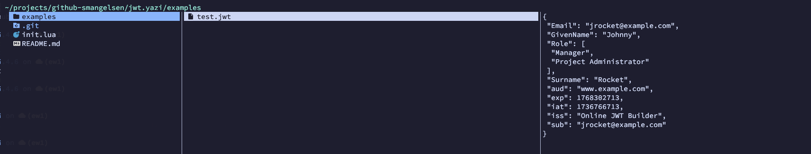

# JWT Preview

This plugin executes `jwt-decoder` binary to decode the payload component in JWT files. Thus the binary must exist in users PATH. We are planning to either replace the JWT functionality with
native Lua support or releasing the Go code in this repository.

## Requirements

- jwt-decoder binary in PATH

## Screenshots



## Usage

1. Run `ya pack -a smangels/jwt`

## Configuration In Yazi

```toml
[plugin]
prepend_previewers = [
	# Archive previewer
	{ name = "*.jwt", run = "jwt-preview" },
]
```
